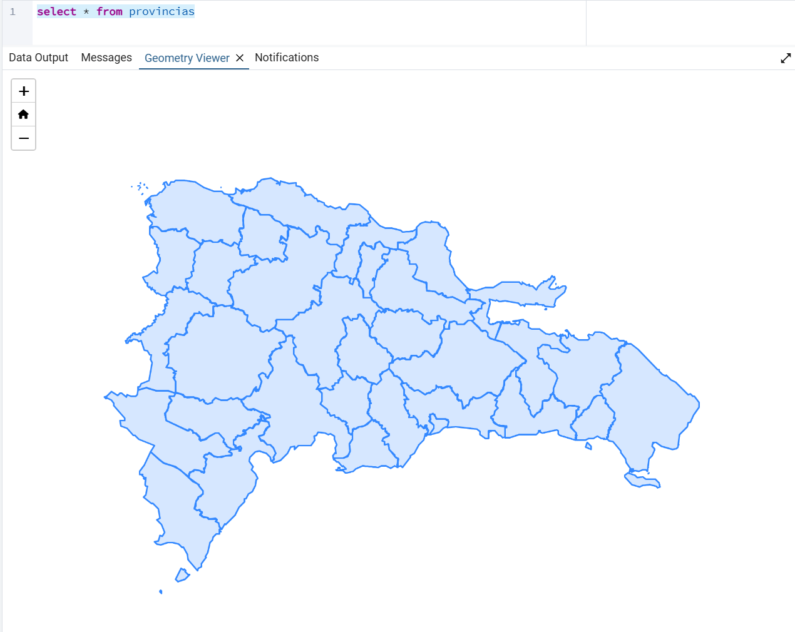
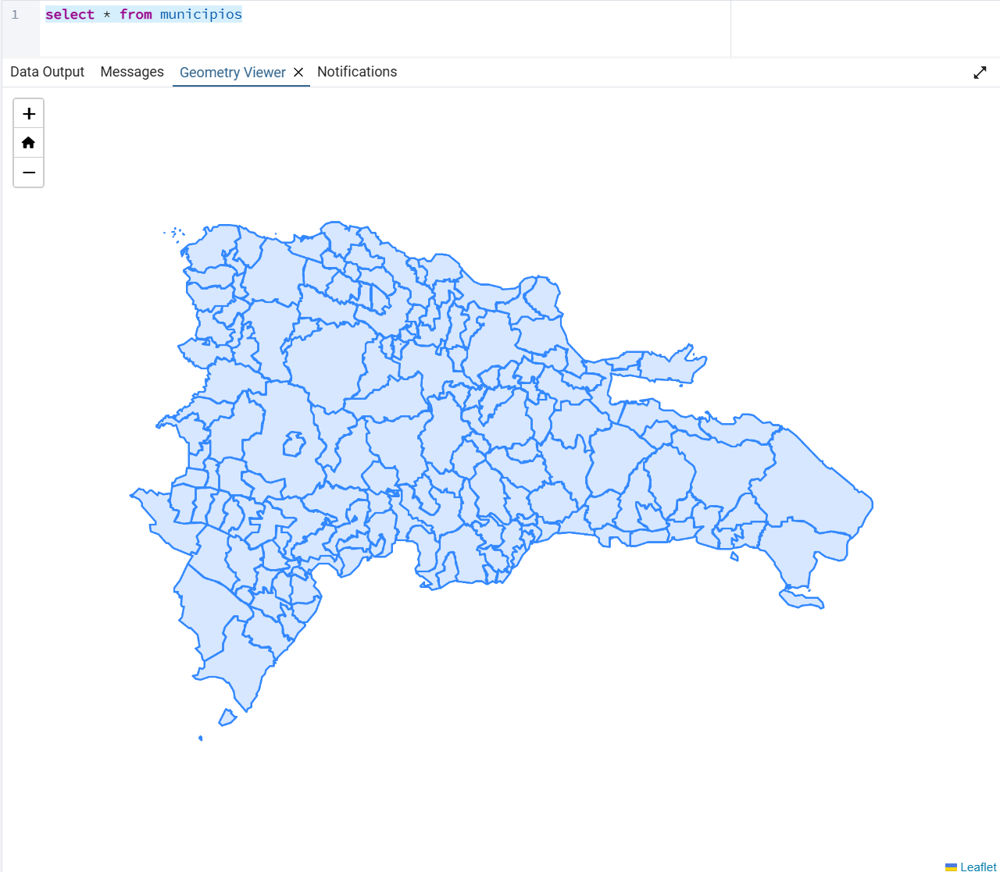
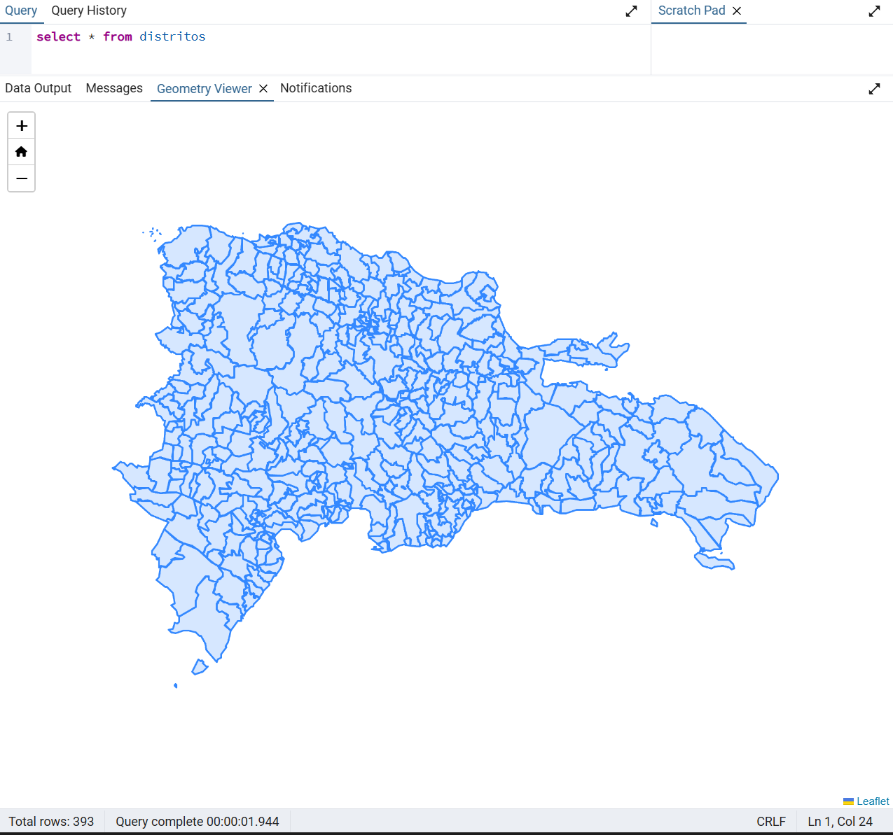
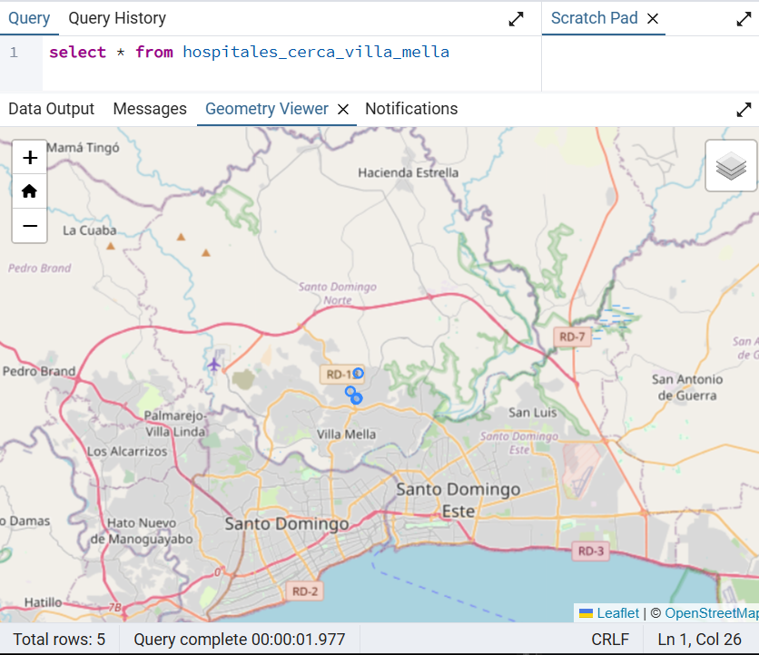
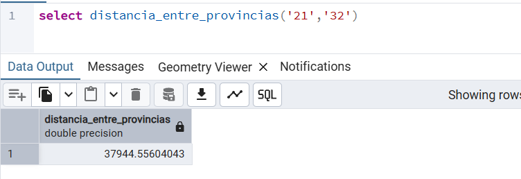
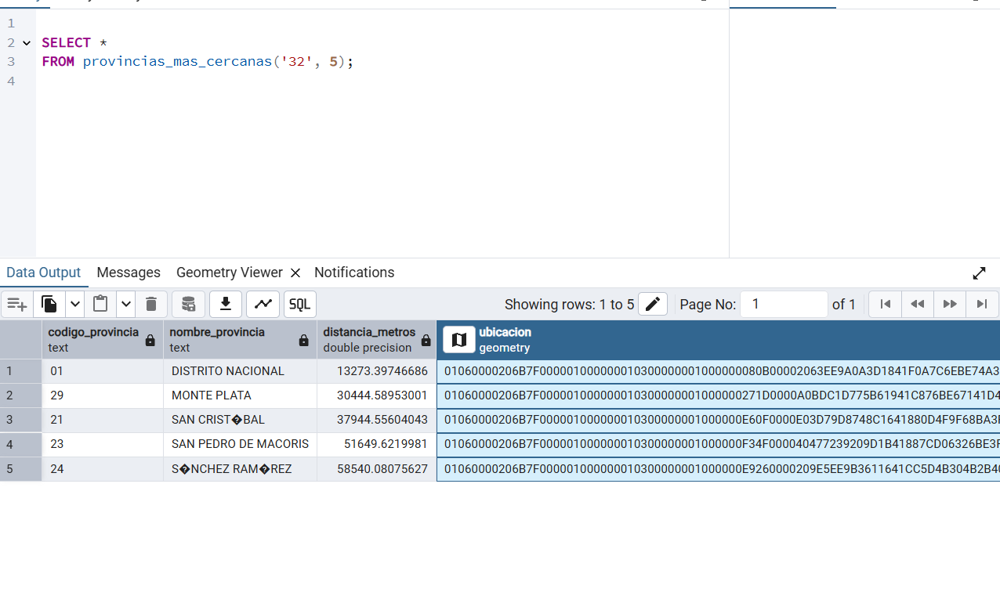
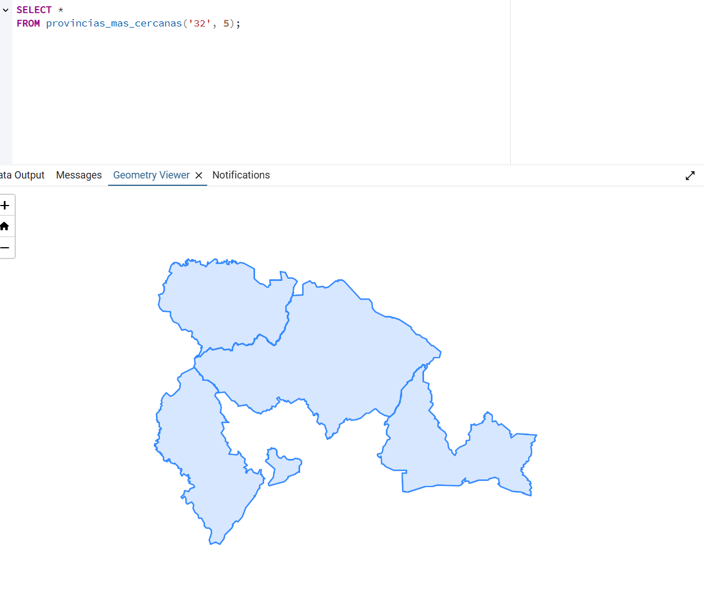

## Esta repo contiene todo para la creaccion de una Base de Datos Geoespacial de la Republica Dominicana.

## Esta segmentado por:

### Provincias

### Municipios

### distritos

Barrios, Secciones y un plus como ejemplo que son puntos de interes, en este caso de hospitales.

### Funciones, triggers y vistas

### En este proyectos encontrara diversias funciones implementadas con funciones nativa de postgis, para casos de uso en el que se quiera medir la distancia entre un punto y otro, los puntos mas cercanos a un punto de interes
- Permite encontrar la distancia en metros entre diversas provincias.

- Permite encontrar las provincias mas cercanas a otra.
 

 
